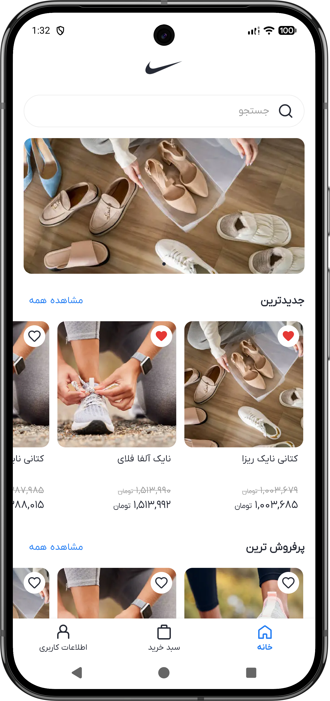
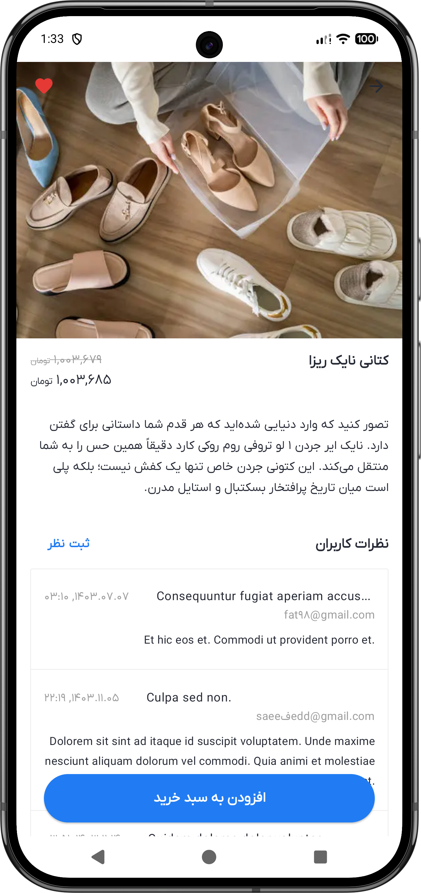
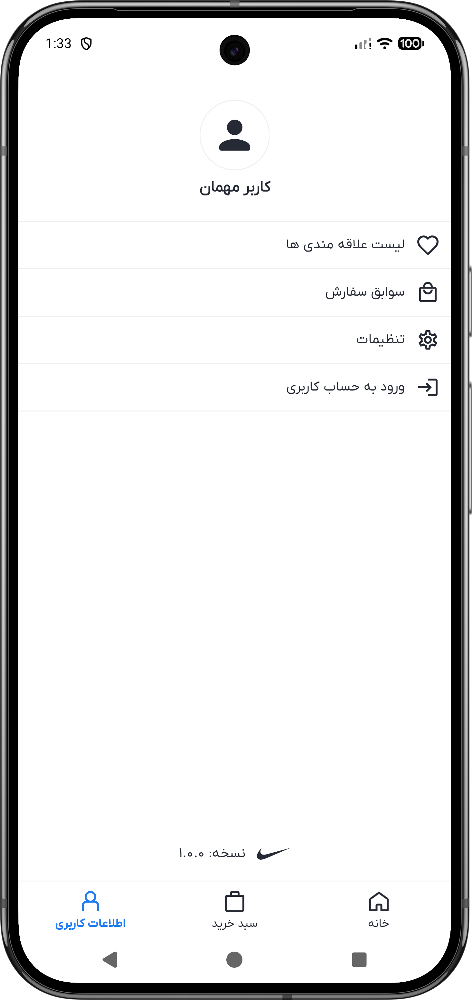
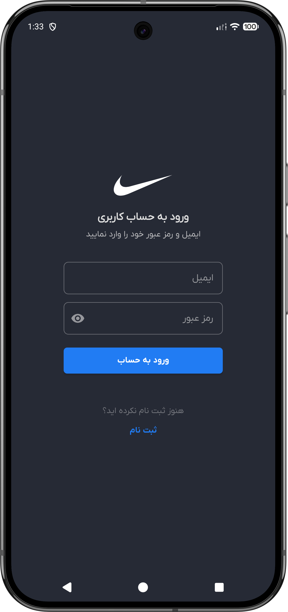
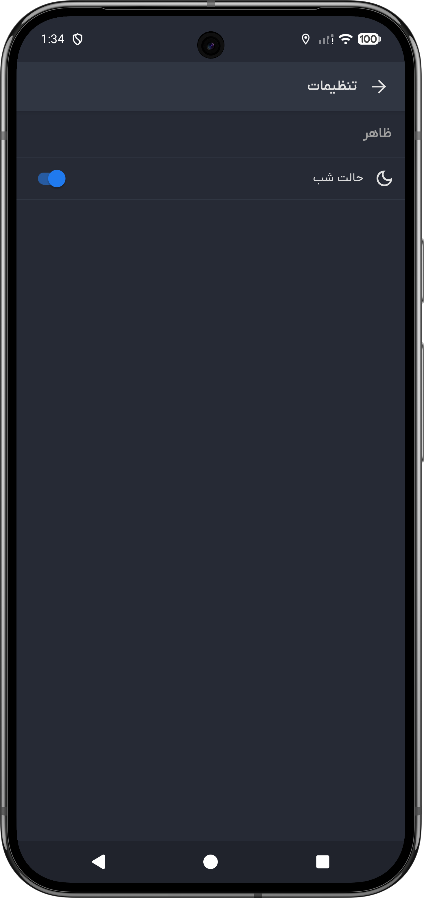

<h1 align="center">👟 Nike Store Android App</h1>

  <strong>A comprehensive e-commerce application for Nike products</strong>

  
  
  

 

## 📱 App Screenshots

<table style="border-collapse: collapse; border: none;">
  <tr>
    <td align="center" style="border: none;">
      
       
      <b>Home Screen</b>
    </td>
    <td align="center" style="border: none;">
      
       
      <b>Product Detail</b>
    </td>
    <td align="center" style="border: none;">
      
       
      <b>Settings</b>
    </td>
    <td align="center" style="border: none;">
      
       
      <b>Sign in</b>
    </td>
    <td align="center" style="border: none;">
      
       
      <b>Dark Mode</b>
    </td>
  </tr>
</table>
